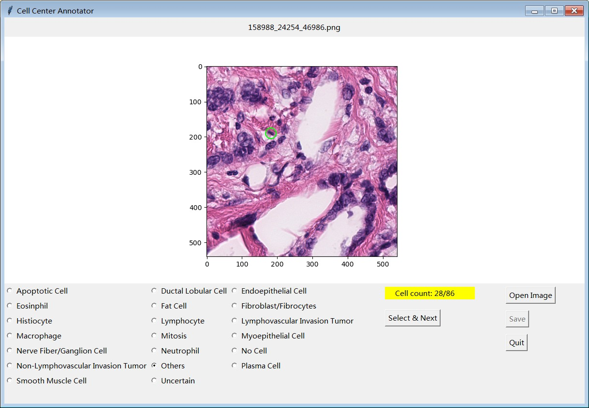

# Introduction

Graphical user interface for cell point annotation tools.


## Usage

The inputs are the image and the coordinates of detected cell centers. Each time there is only one detected cell is circled on the image for the user to classify.


## Installation and usage

### Windows (Tested on Windows 10 and 7)

1. Install Python>3.5
2. Run [`install.bat`](./install.bat) as administrator to install the necessary libraries.
3. Run [`run_app.vbs`](./run_app.vbs) to start the application.

### Linux (Tested on Ubuntu 18.04)

1. Install the required packages:

	```bash
	pip install numpy pandas matplotlib opencv-python
	```

2. Run the application:

	```bash
	python main.py
	```


## Snapshot of application


